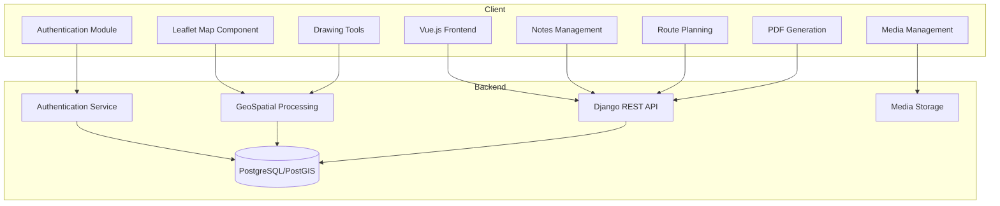
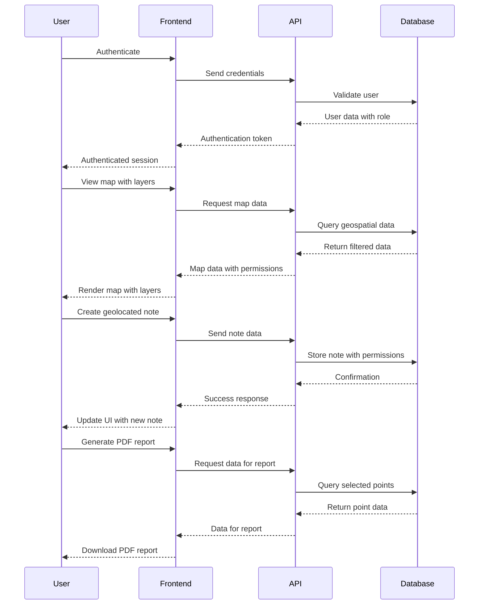
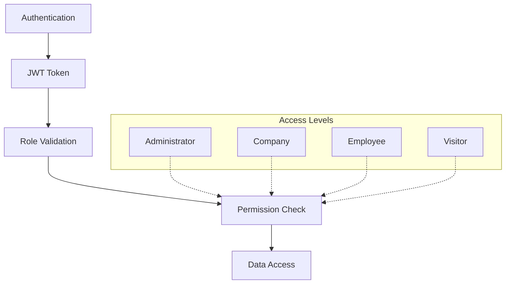

# TagMap System Architecture

## System Overview

TagMap is a web-based application built using a modern client-server architecture, with a clear separation between frontend and backend components. The system is designed to handle geospatial data visualization, annotation, and collaborative features with role-based access control.

## Component Architecture

### Frontend Components

1. **Vue.js Frontend**
   - Main application shell
   - Responsive design for both desktop and mobile
   - State management with Vuex/Pinia

2. **Leaflet Map Component**
   - Map rendering with multiple layer support
   - Custom controls for layer switching
   - Event handling for map interactions

3. **Authentication Module**
   - Login/logout functionality
   - Role-based interface adaptation
   - Permission checks

4. **Notes Management**
   - Creation and editing of geolocated notes
   - Permission management for notes
   - Filtering and searching

5. **Drawing Tools**
   - Polygon creation with area calculation
   - Line drawing with altimetric profiling
   - Shape persistence and editing
   - Note tool icon updated to map pin SVG for better geolocation representation
   - Enhanced location pin with circle underneath to represent drop shadow
   - Improved visibility of the drop shadow with larger dimensions and subtle fill

6. **Media Management**
   - Photo capture interface
   - Media attachment to geographic points
   - Quota management

7. **Route Planning**
   - Route calculation interface
   - Integration with external mapping services

8. **PDF Generation**
   - Client-side report generation
   - Selection of points for inclusion
   - PDF formatting

### Backend Components

1. **Django REST API**
   - RESTful endpoints for all application features
   - JWT-based authentication
   - Cross-origin resource sharing configuration

2. **GeoSpatial Processing**
   - Handling of geographic data formats
   - Spatial calculations (distances, areas)
   - Altimetric profile generation

3. **Authentication Service**
   - User management
   - Role assignment
   - Permission validation

4. **PostgreSQL/PostGIS Database**
   - Relational data storage
   - Geospatial data types and functions
   - Performance optimization for spatial queries

5. **Media Storage**
   - File management and storage
   - Quota enforcement
   - Media optimization

## Data Flow

## Security Architecture

## Technology Stack

### Frontend
- **Framework**: Vue.js
- **Map Library**: Leaflet
- **State Management**: Vuex or Pinia
- **Build Tools**: Vite
- **UI Components**: Custom components with responsive design

### Backend
- **Framework**: Django with Django REST Framework
- **Geospatial**: GeoDjango and PostGIS
- **Authentication**: JWT-based authentication
- **Database**: PostgreSQL with PostGIS extension
- **API Documentation**: Swagger/OpenAPI

### Deployment
- **Frontend**: Static file hosting (Nginx)
- **Backend**: WSGI/ASGI server (Gunicorn/Uvicorn)
- **Database**: PostgreSQL server
- **Media Storage**: File system with proper backup strategy

## Current Workflow Implementation Status

The current implementation status of the system workflows is as follows:

| Workflow | Status | Notes |
|----------|--------|-------|
| User Authentication | To be implemented | Basic structure set up |
| Map Visualization | To be implemented | |
| Note Creation | To be implemented | |
| Drawing Tools | To be implemented | |
| Media Management | To be implemented | |
| Route Planning | To be implemented | |
| PDF Generation | To be implemented | |
| API Integrations | Future work | | 