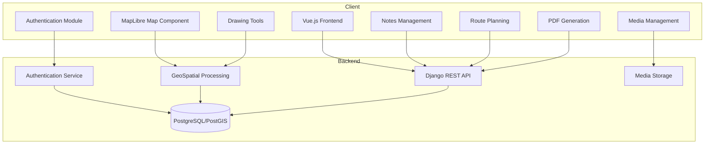
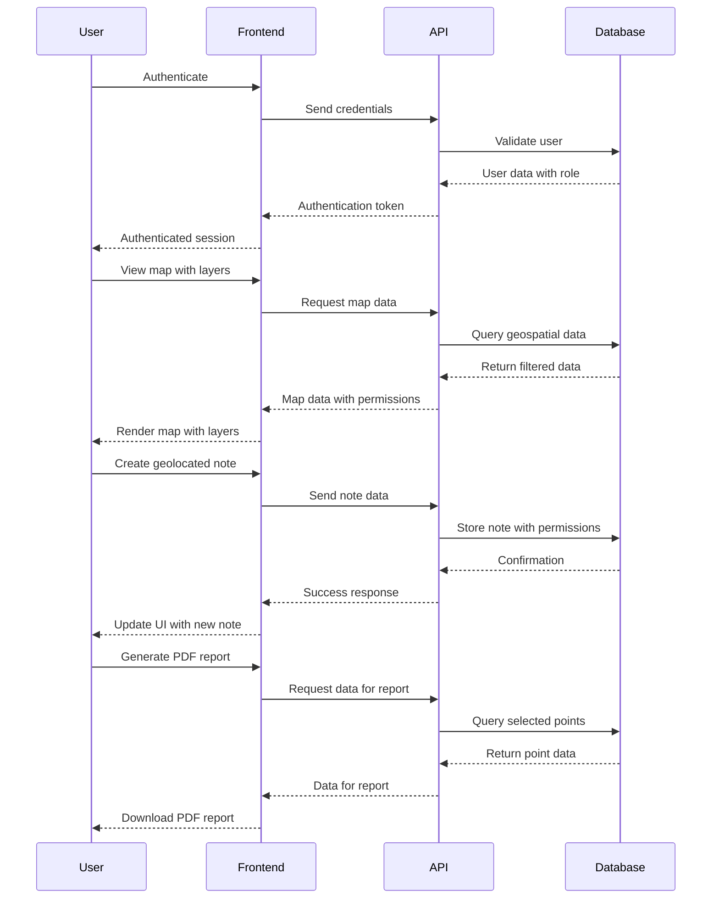
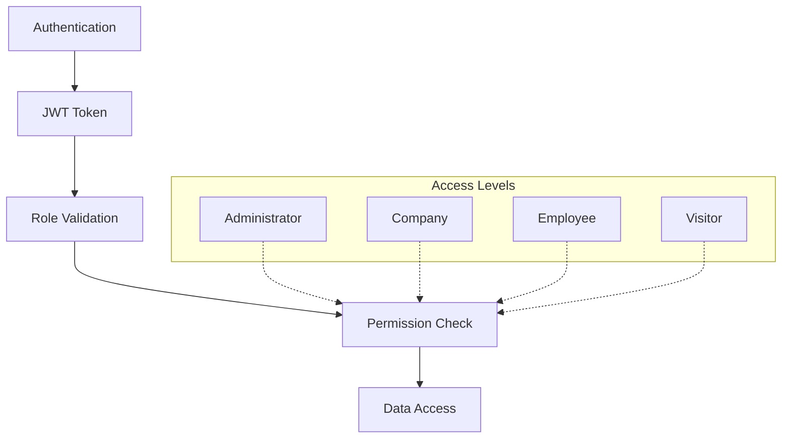

# TagMap System Architecture

## System Overview

TagMap is a web-based application built using a modern client-server architecture, with a clear separation between frontend and backend components. The system is designed to handle geospatial data visualization, annotation, and collaborative features with role-based access control.



## Component Architecture

### Frontend Components

1. **Vue.js Frontend**
   - Main application shell
   - Responsive design for both desktop and mobile
   - State management with Vuex/Pinia

2. **MapLibre Map Component**
   - Map rendering with multiple layer support
   - Custom controls for layer switching
   - Event handling for map interactions

3. **Authentication Module**
   - Login/logout functionality
   - Role-based interface adaptation
   - Permission checks
   - Les salariés disposent d'un bouton pour charger les plans sans visiteur dans MapView (alignement UX avec les entreprises)

4. **Notes Management**
   - Creation and editing of geolocated notes
   - Permission management for notes
   - Filtering and searching
   - Side panel dialog box interface for note management
   - Display enterprise name on notes for administrators

5. **Drawing Tools**
   - Polygon creation with area calculation
   - Line drawing with altimetric profiling
   - Shape persistence and editing
   - All control point creation, update, and interaction logic is centralized in the `useMapDrawing.ts` composable to ensure consistent UI behavior and avoid duplication.
   - Note tool icon updated to map pin SVG for better geolocation representation
   - Enhanced location pin with circle underneath to represent drop shadow
   - Improved visibility of the drop shadow with larger dimensions and subtle fill

6. **Media Management**
   - Photo capture interface
   - Media attachment to geographic points
   - Quota management

7. **Route Planning**
   - Route calculation interface
   - Integration with external mapping services

8. **PDF Generation**
   - Client-side report generation
   - Selection of points for inclusion
   - PDF formatting

### Backend Components

1. **Django REST API**
   - RESTful endpoints for all application features
   - JWT-based authentication
   - Cross-origin resource sharing configuration

2. **GeoSpatial Processing**
   - Handling of geographic data formats
   - Spatial calculations (distances, areas)
   - Altimetric profile generation

3. **Authentication Service**
   - User management
   - Role assignment
   - Permission validation

4. **PostgreSQL/PostGIS Database**
   - Relational data storage
   - Geospatial data types and functions
   - Performance optimization for spatial queries

5. **Media Storage**
   - File management and storage
   - Quota enforcement
   - Media optimization

## Data Flow



## Security Architecture



## Technology Stack

### Frontend
- **Framework**: Vue.js
- **Map Library**: MapLibre GL JS (migrated from Leaflet)
- **State Management**: Vuex or Pinia
- **Build Tools**: Vite
- **UI Components**: Custom components with responsive design

### Backend
- **Framework**: Django with Django REST Framework
- **Geospatial**: GeoDjango and PostGIS
- **Authentication**: JWT-based authentication
- **Database**: PostgreSQL with PostGIS extension
- **API Documentation**: Swagger/OpenAPI

### Deployment
- **Frontend**: Static file hosting (Nginx)
- **Backend**: WSGI/ASGI server (Gunicorn/Uvicorn)
- **Database**: PostgreSQL server
- **Media Storage**: File system with proper backup strategy

## Current Workflow Implementation Status

The current implementation status of the system workflows is as follows:

| Workflow | Status | Notes |
|----------|--------|-------|
| User Authentication | To be implemented | Basic structure set up |
| Map Visualization | To be implemented | |
| Note Creation | To be implemented | |
| Drawing Tools | To be implemented | |
| Media Management | To be implemented | |
| Route Planning | To be implemented | |
| PDF Generation | To be implemented | |
| API Integrations | Future work | |

## Amélioration de l'interactivité cartographique : sélection tolérante et robustesse des GeoNotes

### Sélection tolérante avec Leaflet.AlmostOver
- Intégration du plugin Leaflet.AlmostOver pour permettre la sélection des lignes, polygones et notes géolocalisées (GeoNotes) même si le curseur n'est pas exactement sur la géométrie.
- Utilisation d'une tolérance de 25 pixels pour améliorer l'expérience utilisateur, notamment sur mobile.
- Les événements `almost:over`, `almost:out` et `almost:click` sont utilisés pour surligner, désélectionner et sélectionner les entités cartographiques.

### Robustesse de l'affichage des GeoNotes
- Ajout d'une méthode `forceVisible()` et `recreateIcon()` dans la classe GeoNote pour garantir que les notes restent visibles même en cas de bug d'affichage ou de disparition DOM.
- Après chaque interaction critique (survol, déplacement, zoom), la visibilité de l'icône est vérifiée et, si besoin, l'icône est recréée dynamiquement.
- Tous les styles CSS nécessaires sont appliqués pour garantir la visibilité et la non-disparition des notes, même en cas de conflits avec Leaflet ou d'autres plugins.

### Résilience face aux bugs d'affichage
- Vérification automatique de la taille de l'élément DOM après chaque interaction : si la taille est nulle, l'icône est recréée.
- Gestion robuste des erreurs et logs détaillés pour faciliter le debug frontend.

### UI/UX : Structure des tabs DrawingTools.vue (solution finale)

Pour garantir un scroll fiable dans tous les onglets de DrawingTools.vue (Outils, Style, Filtres), une architecture flex précise est utilisée :

- Le container parent `overflow-hidden.flex.flex-col` utilise `flex: 1; min-height: 0; height: 100%`
- La navigation des onglets `.tabs-container` a une hauteur fixe de 40px avec `flex-shrink: 0`
- Chaque panneau d'onglet utilise la classe `.tab-content` avec :
  - `flex: 1; min-height: 0; overflow-y: auto` (structure de base)
  - Des `max-height` en pourcentage et non en `vh` pour s'adapter à tous les contextes
  - Un padding-bottom plus important sur mobile pour éviter les problèmes avec la barre d'outils

Cette architecture évite les problèmes de scroll couramment rencontrés avec les conteneurs flex imbriqués et fonctionne de manière cohérente sur tous les appareils. 

## Architecture des permissions GeoNotes

Le système de permissions de TagMap repose sur une architecture en couches qui garantit à la fois la sécurité et la flexibilité:

```mermaid
flowchart TD
    User[Utilisateur] --> Role[Rôle Utilisateur]
    Role --> Access[Niveau d'accès]
    
    subgraph "Rôles"
        Admin[Administrateur]
        Enterprise[Entreprise]
        Employee[Salarié]
        Visitor[Visiteur]
    end
    
    subgraph "Niveaux d'accès Notes"
        Private[Private: Créateur uniquement]
        Company[Company: Entreprise + Admin]
        EmployeeAccess[Employee: Entreprise + Salariés + Admin]
        VisitorAccess[Visitor: Tous]
    end
    
    Admin --> AllNotes[Toutes les notes]
    
    Enterprise --> EnterpriseFilter[private | company | employee | visitor]
    EnterpriseFilter --> EnterpriseNotes[Notes liées à l'entreprise]
    
    Employee --> EmployeeFilter[private | employee | visitor]
    EmployeeFilter --> EmployeeNotes[Notes accessibles au salarié]
    
    Visitor --> VisitorFilter[private | visitor]
    VisitorFilter --> VisitorNotes[Notes accessibles au visiteur]
```

### Modèle de données clé

La relation entre entreprises et utilisateurs est gérée par un modèle où:

1. Chaque **GeoNote** contient un champ `enterprise_id` qui est une référence à un objet `User` avec le rôle ENTREPRISE.
2. Pour les utilisateurs SALARIÉ, l'entreprise associée est stockée dans le champ `entreprise` qui est une référence à l'utilisateur ENTREPRISE.
3. Pour les utilisateurs VISITEUR, l'entreprise est accessible via le salarié associé (`user.salarie.entreprise`).

### Traitement des IDs

Pour garantir une comparaison correcte lors du filtrage des notes:

1. Le système extrait l'ID numérique (`note.enterprise_id.id`) au lieu de comparer directement les objets.
2. La comparaison se fait entre valeurs numériques pour éviter les problèmes d'égalité d'objets.
3. Cette approche résout les avertissements de comparaison incorrecte qui apparaissaient dans les logs.

Ces mécanismes permettent de maintenir une architecture de permissions robuste tout en facilitant le diagnostic des problèmes d'accès. 

## Admin Settings Page: Google Maps API Key

A dedicated admin-only settings page (`ParametresView.vue`) allows administrators to securely configure the Google Maps API key. The key is stored in the database through the `ApplicationSetting` model and is accessed via a secure API endpoint.

**Workflow:**
- Admin navigates to `/parametres` (visible only to admins).
- The page displays a password-type input for the Google Maps API key.
- On save, the key is securely stored in the database via the backend API.
- The frontend loads Google Maps via a backend-generated URL with the key already embedded.
- The backend-only handles the actual API key, never exposing it to the client.
- A secure public endpoint `/api/settings/get_google_maps_api_key/` provides only a pre-constructed URL with the key embedded.
- The admin-only endpoint `/api/settings/set_google_maps_api_key/` allows updating the key.

**Security Features:**
- The key is never transmitted to the client or exposed in network requests.
- Admin-only access to the settings page and modification endpoints.
- The Google Maps API key is securely stored server-side only.
- The frontend only receives a complete script URL, not the key itself.
- Key status indicator shows if key is configured without revealing the key.

**Impact:**
- No redeployment is needed to update the API key.
- Hybrid map layer (Google Maps) uses the latest key from the server.
- Maximized security by keeping sensitive API keys completely server-side.
- No possibility of API key extraction from client-side code or network requests. 